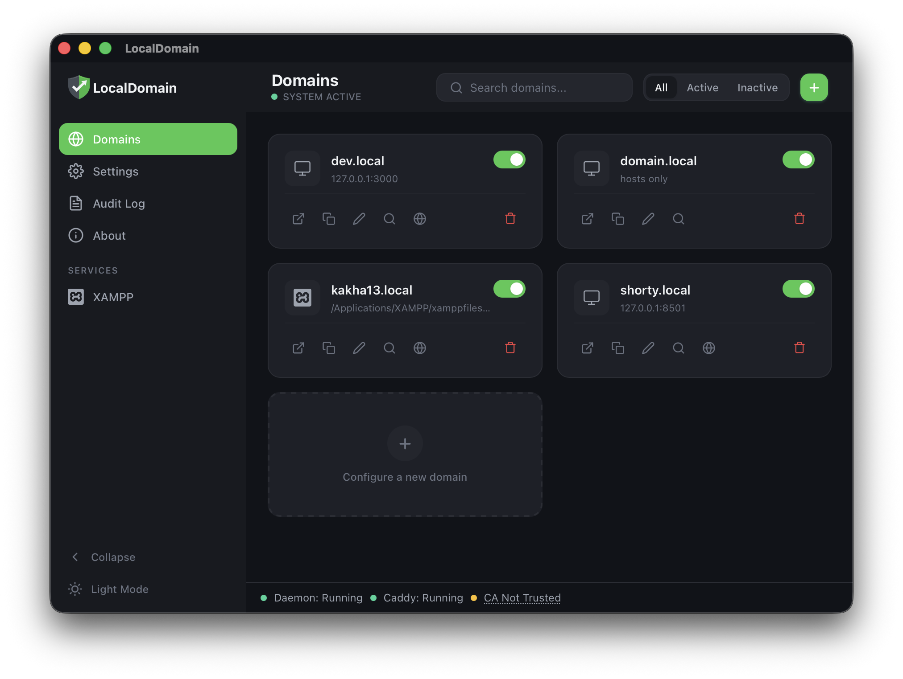

  

<h1 align="center">LocalDomain</h1>

  <a href="https://getlocaldomain.com/"><strong>Website</strong></a> ·
  <a href="https://getlocaldomain.com/docs"><strong>Documentation</strong></a> ·
  <a href="https://github.com/kakha13/localdomain/releases">Releases</a>

  

  
  

LocalDomain is a desktop application that simplifies local HTTPS development. It automatically manages your `/etc/hosts` file, generates TLS certificates, and configures a reverse proxy so you can access your local projects via custom domains with HTTPS enabled.

> **Vibe coded with AI** — This app was built with significant assistance from AI. A lot of tokens were used to build this project.
>
> **Model used:** Claude Opus 4.6 + Claude Code

The project includes a [CLAUDE.md](CLAUDE.md) file with development guidelines, architecture documentation, and build commands.

  

## Features

- **Automatic hosts management** — Add and remove local domains with a single click
- **Automatic TLS certificates** — Self-signed CA with one-click trust installation
- **HTTPS everywhere** — Built-in Caddy reverse proxy handles HTTPS termination
- **Audit logging** — Track all access requests to your local domains
- **XAMPP integration** — Automatically detect and work with XAMPP localhost servers
- **Free tunnels** — Share your local development site via free tunnel services
- **Custom domain tunnels** — Use your own domain with tunnel sharing
- **Cross-platform** — Works on macOS, Linux, and Windows

## Documentation

Full documentation is available at [https://getlocaldomain.com/docs](https://getlocaldomain.com/docs)

## License

MIT

